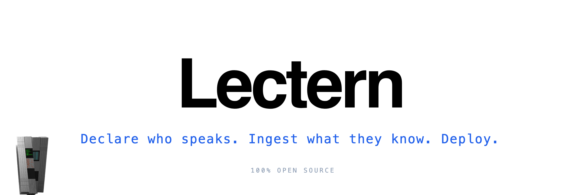
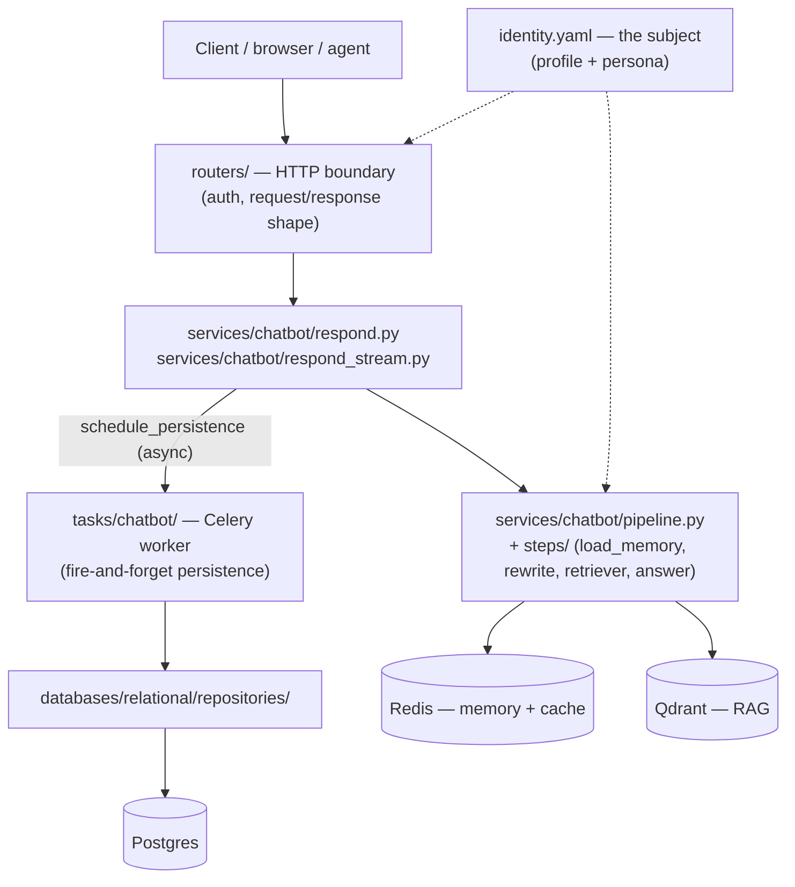

  

## Description

**Lectern** is a self-hostable, headless backend that turns a declared identity
and a set of documents into a grounded conversational API.

The system offers:
- Retrieval-augmented answers, as a single JSON document or streamed over SSE
- Text or audio questions, transcribed server-side
- Per-session memory (rolling summary plus recent interactions)
- Analytics on every exchange: retrieved documents and scores, token usage per
  model call, and visitor feedback

> The subject can be a person, a company or a product. It is whoever the deployment's identity file declares.

### Zero pipeline configuration. All subject configuration.

You do not choose *how* it thinks. The pipeline ships assembled and wired,
`load_memory → rewrite → retrieve → answer`, with grounding, memory, cache and
analytics already in place. You declare *what it speaks about*, and it does not
stray from that: it never states a fact that is not in your corpus, and it
records every time it could not answer.

---

## Documentation

- [Architecture](docs/architecture.md) — layers, request flows, and the
  reasoning behind the notable decisions.
- [Development](docs/development.md) — running and working on it locally.
- [Code guidelines](docs/guidelines.md) — conventions the codebase follows.
- [Domain concepts](docs/concepts.md) — what an exchange, an execution, the
  memory and the cache actually are.
- [Deployment](deploy/README.md) — how to self-host it, with Docker Compose.

---

## Configuration

**`identity.yaml`** — the subject: the profile served by `/api/whoami` and the
persona the assistant speaks in. `identity.example.yaml` documents every field.
Unknown keys under `persona` are rejected rather than ignored, so a typo fails
at startup instead of quietly changing behaviour.

**`.env`** — infrastructure: database URLs, API keys, model names, limits.
See `.env.example` for the settings a deployment normally sets.

Two settings worth knowing:

- `API_PREFIX` (default `/api`) — every route lives under it, and the reverse
  proxy is expected to forward it as-is, not strip it.
- `CORS_ORIGINS` — comma-separated. `/api/whoami` is open to any origin
  regardless; everything else is restricted to this list.

---

## Architecture

How a request travels, and which layer owns what. The full walkthrough, with
the streaming and non-streaming flows, is in
[docs/architecture.md](docs/architecture.md).

---

## Tech Stack

| Layer                | Technology                                      |
|----------------------|-------------------------------------------------|
| **Language**         | Python 3.12                                     |
| **Framework**        | FastAPI + Uvicorn                               |
| **Database**         | PostgreSQL                                      |
| **ORM**              | SQLAlchemy (async) + psycopg                    |
| **Migrations**       | Alembic                                         |
| **Vector store**     | Qdrant                                          |
| **Cache and memory** | Redis                                           |
| **Background jobs**  | Celery                                          |
| **LLM**              | LangChain + OpenAI (chat, embeddings, Whisper)  |
| **Validation**       | Pydantic + pydantic-settings                    |
| **Identity config**  | YAML                                            |
| **Audio**            | ffprobe (duration) + filetype (format sniffing) |
| **Tooling**          | uv, Ruff, mypy, pytest                          |
| **Containerization** | Docker                                          |

---

## Development Setup

To work on Lectern, read the [development guide](docs/development.md).

---

## Deploy

To self-host it, read the [deployment guide](deploy/README.md).

---

## License

[Apache-2.0](LICENSE). No usage restrictions, no source-available clause: you
can run it, modify it and deploy it commercially. The patent grant and the
trademark reservation in sections 3 and 6 are the reason for choosing it over
MIT.
