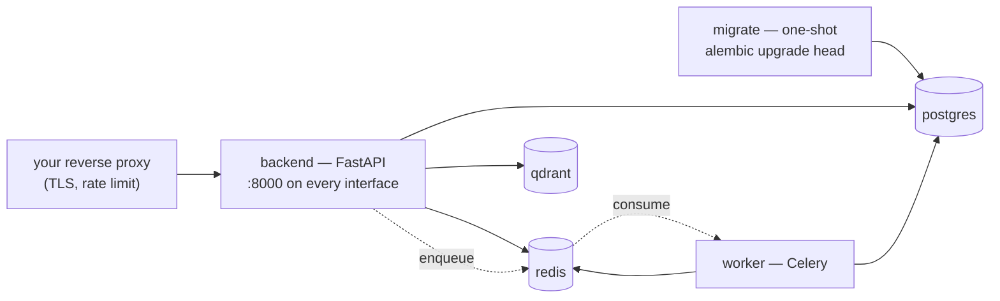

# Deployment

Everything needed to run Lectern and its datastores with Docker Compose. See
[../docs/architecture.md](../docs/architecture.md) for what the services
actually do, and [../docs/concepts.md](../docs/concepts.md) for the vocabulary
this document assumes.

## Requirements

- [Docker](https://docs.docker.com/engine/install/) with Compose v2
- An [OpenAI API key](https://platform.openai.com/docs/api-reference)

## Running it

```bash
# 1. declare who this instance speaks for
cp ../identity.example.yaml ../identity.yaml && $EDITOR ../identity.yaml

# 2. fill in the secrets
cp .env.example .env && $EDITOR .env

# 3. build and start
docker compose up -d --build

# 4. confirm
curl -s localhost:8000/api/system/health
```

Step 1 is not optional and not reorderable: `identity.yaml` is bind-mounted
into both application containers, and Docker creates a *directory* where a
missing bind-mount source should be. Get that wrong and the containers start,
then fail to parse their own identity as YAML.

**The API is published on every interface**, not just loopback: the mapping is
`8000:8000`. On a host that is directly on the internet, that means the API
answers on port 8000 from anywhere, alongside — and bypassing — whatever proxy
you put in front of it, along with the TLS and the rate limiting that proxy was
there to provide. Two things worth knowing about that:

- A firewall rule is not enough on Linux. Docker publishes ports by writing to
  the `nat` table directly, so a UFW rule denying 8000 does not close it. Bind
  the port to `127.0.0.1:8000:8000` instead, or restrict it upstream of the
  host.
- `FORWARDED_ALLOW_IPS` is unset, so uvicorn falls back to `*` and trusts any
  `X-Forwarded-For` it is handed. With the port reachable, a client can put
  whatever it likes there, and that is the `request_ip` stored against every
  session.

The intended deployment has the machine behind a network boundary — a private
network, a VPN or an SSH tunnel — where reaching port 8000 requires already
being inside. If that is your setup, this is fine as it stands. If the host is
directly exposed, change the mapping.

## What runs



| Service | Image | What it is |
|---|---|---|
| **backend** | built from `../Dockerfile`, target `api` | The HTTP API. Published on port 8000 of every interface — see the warning under [Running it](#running-it). |
| **worker** | built from `../Dockerfile`, target `worker` | Celery. Persists analytics, refreshes summaries, writes the response cache. |
| **migrate** | same image as `backend` | Runs `alembic upgrade head` once and exits. The other two wait for it to succeed. |
| **postgres** | `postgres:17` | Sessions, exchanges, executions, feedback. |
| **redis** | `redis:8` | Response cache, conversation memory, and the Celery broker — all three at once. |
| **qdrant** | `qdrant/qdrant:v1.18` | The vector store the answers are grounded on. |

Plus a development-only container, `dev`, built from `Dockerfile.dev`. It runs
only under the development overlay — see
[../docs/development.md](../docs/development.md).

Two networks: `edge` carries the application services and whatever proxy you
attach, `internal` carries the datastores. The datastore ports are published to
`127.0.0.1` for `psql` and `redis-cli`, never to the host's public address. The
API is the exception, and deliberately so — see below.

## Local development

To understand how to set up a local development environment,
read the [development guide](docs/development.md).
