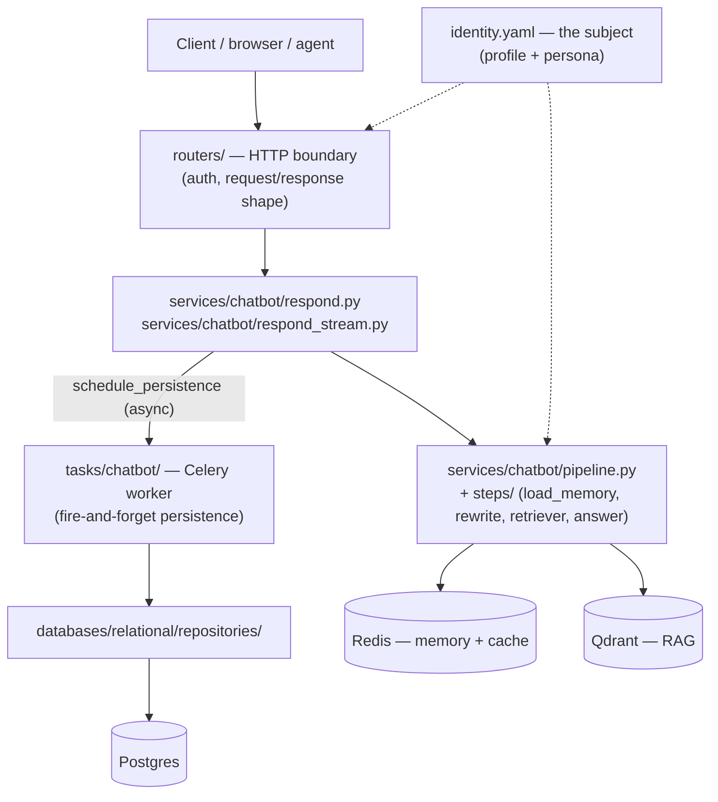
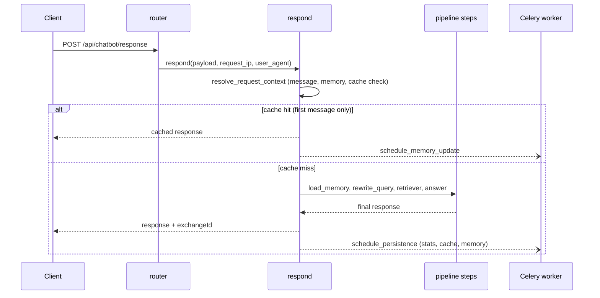
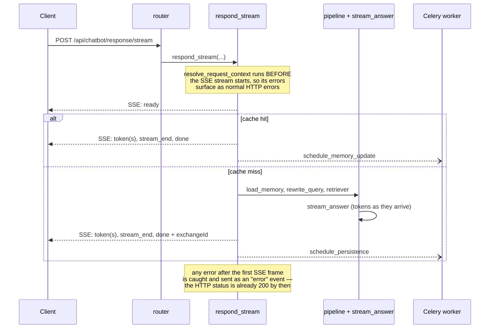

# Architecture

See [concepts.md](concepts.md) for the domain glossary this document assumes.

## Layers



## The subject

Who the assistant speaks for is not in the code. `identity.yaml` (see
`identity.example.yaml`) carries two blocks, loaded once per process by
`src/identity.py`:

- `identity` — served as-is by `GET /api/whoami`. Only `name` is required;
  everything else is free-form, so the subject can be a person, a company or a
  product.
- `persona` — the subject name, scope, assistant character, corpus language,
  baseline summary and few-shot examples. These fill the `[[placeholders]]` of
  the prompt templates in `services/chatbot/prompts.py`.

Unknown keys under `persona` are rejected, because a silent typo there (a wrong
`corpus_language`, say) would degrade retrieval instead of failing.

## Request flow — non-streaming (`POST /api/chatbot/response`)



## Request flow — streaming (`POST /api/chatbot/response/stream`)



## Errors

Every failure answers with the same envelope, so clients branch on a stable
slug instead of parsing messages:

```json
{"error": "invalid_request_error", "message": "Bad Request!"}
```

The slug is derived from the error class name, and the status code, log level
and client-facing message are declared on the class itself
(`src/errors/backend_error.py`). Starlette resolves handlers by walking the
exception's MRO, so one registration in `src/errors/handlers.py` covers every
subclass. A catch-all handler keeps the envelope even for errors that are not
`BackendError`, and the router's own 404/405 go through it too.

Steps do not re-type errors they cannot classify: wrapping a provider error
(a rate limit, say) into a generic one costs the stream layer the type it
classifies on, so it answers `unavailable` instead of `rate_limit`.

## Background persistence (Celery)

`schedule_persistence` / `schedule_feedback` / `schedule_memory_update` enqueue
tasks and return immediately — a broker outage never fails a request that has
already been answered (`dispatch_task` swallows and logs). Swallowing the
exception is only half of it: the publish is also bounded by socket timeouts
in `src/worker.py`, because a broker that accepts the connection and never
answers would otherwise block the request forever, and a hang cannot be caught.
The worker runs `--pool` prefork (default): each child process keeps one
persistent asyncio event loop (`tasks/runner.py`), reused across every task it
picks up, so the async repositories/Redis client stay bound to a live loop
instead of being recreated per task.

## Notable decisions (and why)

- **A hand-rolled CORS middleware.** Starlette's applies one origin policy to
  the whole app and buffers the response; this one scopes `/whoami` open to
  any origin and streams safely in front of the SSE endpoint.
- **Audio duration read with `ffprobe`**, not by decoding. It reads the
  container metadata, so the cost does not grow with the length of the audio.
