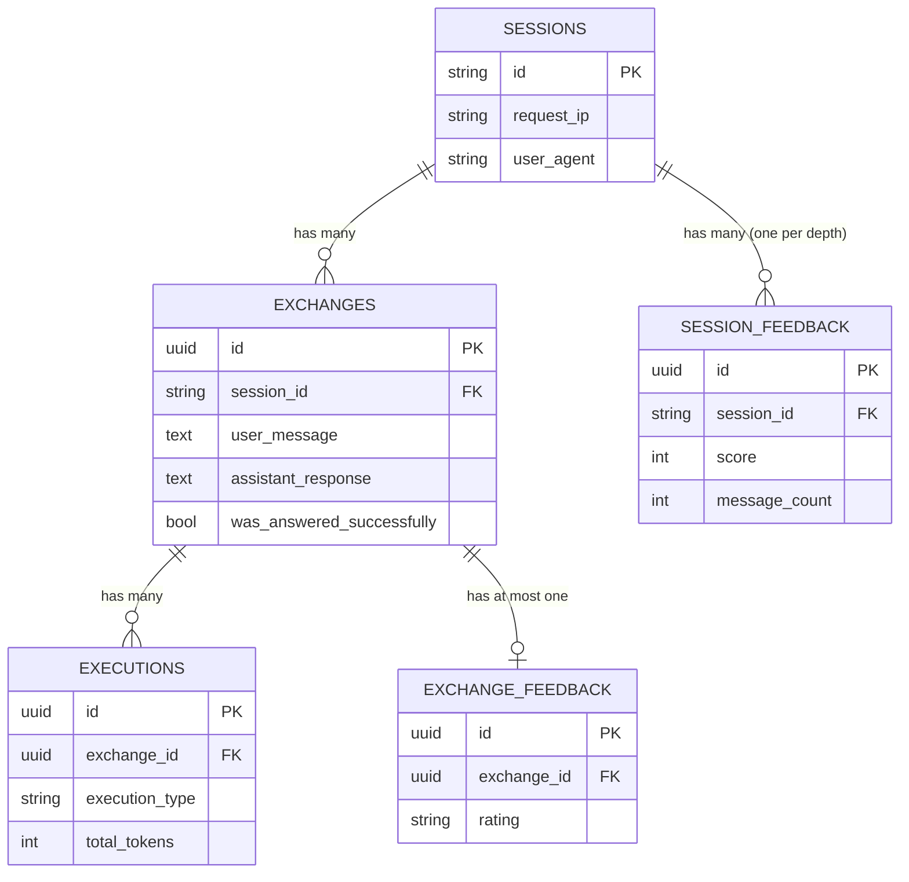

# Domain Concepts

Glossary of the core concepts in this codebase, grouped by what they actually
are: the configured subject, persisted entities, request-scoped process
concepts, and infrastructure plumbing.

## The subject

Deployment configuration, read from `identity.yaml` at startup. None of it is
in the code: a fresh checkout answers for whoever the operator declares.

| Concept | What it is |
|---|---|
| **Subject** | The entity this instance speaks for. A person, a company, a product. Exactly one per deployment. Its profile is served verbatim by `GET /api/whoami`. |
| **Persona** | How the assistant talks *about* the subject: name and short name, what is in scope, the assistant's own character, the corpus language, a baseline summary, and few-shot examples. Fills the prompt templates. |
| **Corpus** | The ingested documents the answers are grounded on, embedded into Qdrant. The assistant never states a fact that is not in the corpus or the baseline summary. |

## Persisted entities

| Concept | What it is |
|---|---|
| **Session** | One visitor session (`sessionId`, generated by the frontend). Ties multiple exchanges together for visitor-level analytics. |
| **Exchange** | One question + one answer. Gets a fresh `exchangeId` on every message — *not* the whole chat thread, just a single turn. Several exchanges share the same session. |
| **Execution** | Metrics for a single LLM call (tokens, model, duration). An exchange has several: query rewrite, answer, metadata extraction. |
| **Exchange feedback** | A visitor rating (up/down + optional comment) on one specific answer. At most one per exchange: an exchange never changes, so a second rating of it is a change of mind, and it overwrites. Attributable — it joins to the documents that answer retrieved, so it can point at a cause. |
| **Session feedback** | A visitor rating of a whole conversation (0-10 + optional note). Measures whether the visit was worth their time — not attributable to any single answer, and not a replacement for the one above. A session collects **several**, one per depth it was rated at, because the conversation keeps growing: the sequence is the satisfaction trajectory. |

## Request-scoped process concepts

These exist only while a request is being handled — none of them is a table.

| Concept | What it is |
|---|---|
| **State** | The working data for one exchange as it moves through the pipeline (message, memory text, rewritten query, RAG context, response, executions). Built fresh per request, discarded after. |
| **Pipeline / Steps** | The ordered functions that build a response: `load_memory -> rewrite_query -> retriever -> answer` (or `stream_answer`). Plain sequential `async` calls. |
| **Memory** | The incremental conversation summary (Redis), accumulated *across* exchanges in a session. Different from `State`, which only lives for one exchange. |
| **Cache** | Cached response keyed by question text, used only for a session's first message. A separate concept from `Memory`. A hit still records an exchange, flagged `served_from_cache` and carrying no executions, so the most popular questions do not vanish from the analytics. |
| **Orchestrators** | `respond()` / `respond_stream()` — the two delivery modes for the same exchange: one-shot JSON vs token-by-token SSE. Both run the same pipeline steps and only diverge at the final answer step. |

## Infrastructure

Makes everything work, but isn't "about the business."

| Concept | What it is |
|---|---|
| **Resources** | Process-wide singleton holding shared connections (Postgres engine, Redis client, Qdrant client, repositories). |
| **Repository** | Data-access layer per entity (`ExchangesRepository`, `ExecutionsRepository`, ...), wrapping SQLAlchemy. |
| **Persistence dispatch** | Fire-and-forget Celery tasks that write exchange/execution/feedback/session rows and update memory *after* the response is already sent — never on the request's critical path. |
| **Error envelope** | The single shape every failure answers with: `{"error": <slug>, "message": <text>}`. The slug comes from the error class name, so clients branch on it instead of parsing messages. |
